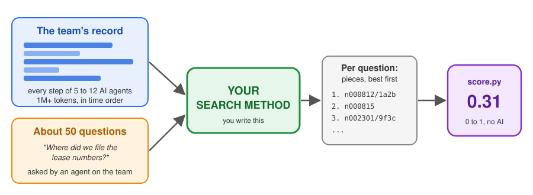
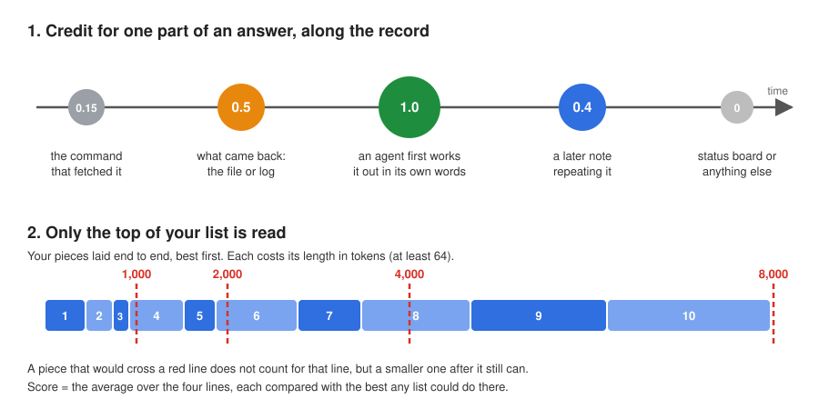

# MultiAgent-IRBench

Test your search method on the memory of an AI agent team.



A team of AI agents works on a real job for hours, and every step they take is saved. Later one of them asks "where did we put X?". Your method searches the saved record and hands back the pieces that answer it. `score.py` grades those pieces.

## Try it (1 minute)

You need Python 3.8 or newer. Nothing to install. On Windows type `python`; on Mac or Linux type `python3`.

```
git clone https://github.com/orbi8r/MultiAgent-IRBench
cd MultiAgent-IRBench
python example_bm25.py runs/on_call my_submission.json
python score.py runs/on_call my_submission.json > report.json
```

The last line printed is your result:

```
score 0.258 out of 1 | +0.160 against a method that ignores the question | every part found for 28% of 50 questions
```

## Plug in your own method

1. Open `my_method.py`.
2. Replace the inside of `rank(question, blocks)` with your search. Return ids, best first.
3. Run and score it:
   ```
   python my_method.py runs/on_call my_submission.json
   python score.py runs/on_call my_submission.json > report.json
   ```
4. Do the same for every folder in `runs/`.

Any language or tool works, as long as it writes the same JSON file.

## What is in a run

Each folder in `runs/` is one team.

| File | What it is | Use it |
|---|---|---|
| `questions.jsonl` | the questions | yes |
| `blocks.jsonl` | the record cut into small pieces, up to 8 lines each (usually about 60 tokens) | yes, search these |
| `events.jsonl` | the record as whole steps, in time order (a few tokens up to about 6,600) | for more context |
| `answer_key.json` | the answers | never, only the scorer reads it |
| `empty_submission.json` | every question with an empty list | to see the output shape |

One line of each:

```
questions.jsonl  {"qid": "a02", "question": "Where did the finished first incident end up, its postmortem and its done marker?", "qtype": "location", "asker": "commander"}
blocks.jsonl     {"id": "n003462/8eb830d98519e34f", "event": "n003462", "tokens": 27, "text": "/workspace/incidents/done/02/POSTMORTEM.md\n/workspace/incidents/done/01/POSTMORTEM.md"}
events.jsonl     {"id": "n000163", "agent": "oncall_triage", "kind": "model", "ts": 1790638165.197, "shift": 2, "conv": "c4623438...", "text": "Now I have a clear picture. Let me write my triage findings and send them to the commander.\n", "tokens": 21}
```

`kind` says what a step is: `prompt` (the agent's instructions at the start of a shift), `model` (what the agent said), `tool_call` (a command it ran or a file it wrote) or `tool_result` (what came back). `asker` is the agent asking, so you know who "I" or "my" means. A few very short events have no block; return those as whole events.

## What you hand back

One JSON file per run. For each question, a list of block ids or event ids, best first:

```
{"a01": ["n003462/8eb830d98519e34f", "n000163", "..."], "a02": ["..."]}
```

The list can be any length.

## How the score works



1. Every answer has 1 to 3 parts. Each part gets the best credit among your pieces that fit.
2. This is done at 4 budgets, reading only the first 1,000, 2,000, 4,000 or 8,000 tokens of your list, and averaged.
3. Compare methods by the middle number of the result line: how far you beat the best method that never looks at the question.
4. The same file always gets the same score. No AI is involved.

Tip: short pieces first. One long event can eat the whole budget.

## The runs

| Run | The team | Questions | Size |
|---|---|---|---|
| `library_maintainers` | 12 agents ship a release of the dateutil library from its real issue list | 50 | 1.0M tokens |
| `debate_panel` | 6 agents debate open physics questions using real papers | 50 | 1.8M |
| `textbook_team` | 11 agents write worked problems from real open textbooks | 50 | 1.1M |
| `help_desk` | 6 agents answer real jq questions from GitHub | 50 | 1.2M |
| `executive_assistants` | 5 assistants run a director's office from a real mailbox (the Enron archive) | 50 | 1.2M |
| `due_diligence` | 5 agents check real SEC filings of Apple and Microsoft and sign a memo | 50 | 1.1M |
| `on_call` | 7 engineers handle incidents in real system logs and write postmortems | 50 | 1.4M |
| `city_data` | 7 analysts write monthly council reports from real NYC 311 service requests | 49 | 1.3M |
| `literature_review` | 5 researchers write literature reviews from real arXiv papers | 49 | 1.2M |
| `online_shop` | 3 staff run a simulated shop on a real UK retailer's orders: stock, prices, books and monthly reports | 50 | 1.4M |

